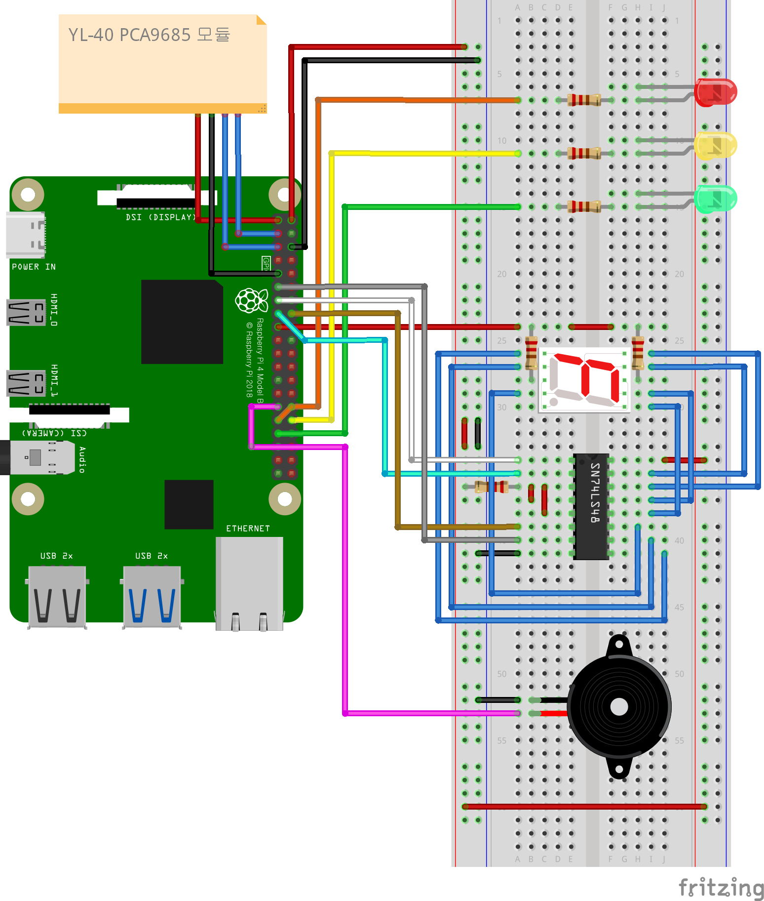

# 원격 장치 제어 프로그램 개발 보고서 (Development Document)
TCP/IP 소켓 통신 및 라즈베리파이 4 기반의 하드웨어 입출력 장치 제어 시스템에 대한 상세 설계 및 개발 구현 보고서입니다.
## 1. 프로젝트 개요

본 프로젝트는 라즈베리파이 4 하드웨어에 탑재된 다양한 주변 장치(LED, 부저, 조도 센서, 7세그먼트)를 원격의 우분투 리눅스 단말에서 TCP 소켓 통신을 이용해 안전하고 편의성 있게 제어하는 임베디드 관리 프로그램 개발을 목표로 합니다.
- **공유 라이브러리화**: 핵심 장치 구동 함수군을 [libRemoteIO.so](lib/) 동적 공유 라이브러리로 격리 빌드하여, 기기 기능 향상 시 데몬 프로세스 컴파일 없이 라이브러리 교체만으로 가동되게 설계하였습니다.
- **백그라운드 데몬화**: 서버 프로세스는 `fork()` 및 `setsid()`를 거치는 표준 리눅스 데몬 아키텍처를 도입하여 시스템 시작 및 안정적 운용을 보장합니다.
- **시그널 처리 및 중계 터미널**: 클라이언트 프로그램은 임의 종료 신호를 방어(마스킹)하되, `SIGINT`에만 안전한 소켓 해제를 거쳐 탈출하도록 안정성을 증대시켰습니다.
- **자원 경량화 및 잠금 메커니즘**: 서버에서 직접 CLI 화면 및 세션 상태를 통제하는 릴레이 방식을 채택하여 클라이언트를 가볍게 구성했으며, 다중 클라이언트 연결 시 출력 장치 충돌을 예방하는 세션 점유 락(Lock) 기능을 포함합니다.
- **ARM64 크로스 컴파일 지원**: 호스트 PC(x86_64) 환경에서 타겟 보드(라즈베리파이 4, ARM64)에 알맞은 바이너리를 생성할 수 있도록 전용 CMake 툴체인 파일 설정을 구성하여 임베디드 배포 유연성을 향상했습니다.

## 2. 개발 일정

기초 센서 테스트부터 최종 안정성 향상 리팩토링 및 검증 계획 수립까지 3일에 걸쳐 진행된 일정입니다.
- **Day 1: 부품 분석 및 환경 설계**
  - 주변 장치 데이터시트 확인 및 GPIO 핀 배치 구성
  - Fritzing 툴을 사용한 보드 배선도 및 회로 구성 설계
  - 센서 기본 구동 코드 테스트 및 I2C 통신 확인
  - TCP 다중 접속 구조 설계를 위한 상태 세션 다이어그램 정의
- **Day 2: 핵심 비즈니스 로직 및 서버 데몬 구현**
  - `fork()` 기반의 서버 데몬화 로직 및 `dlopen()` 공유 라이브러리 연동 코드 구현
  - LED(PWM), 부저(멜로디), 조도센서(YL-40), 7-Segment(카운트다운) 스레드 제어 로직 구현
  - 다중 세션 분배 및 세션 잠금(Lock) 알고리즘 통합 완료
  - 클라이언트 시그널 마스킹을 통한 오동작 방지 설계 완료
  - FND 플로팅 오작동 해결 및 PCF8591 I2C Dummy Read 무효화 수정 완료
  - `write` 통신부 `strlen` 전면 도입을 통한 문자열 잘림 및 메모리 노출 취약점 극복
  - `pthread_cancel` 시 비동기 스레드 동적 할당 인자 메모리 누수 방지 리팩토링 수행
  - 빌드 속도 개선을 위한 CMAKE 및 Makefile 증분 빌드 자동화 스크립트 작성
- **Day 3: 구조적 모듈화 분할 리팩토링 및 배포 고도화**
  - 소켓 통신 모듈(`server_socket`)과 입출력 장치 제어 모듈(`io_control`) 분리 및 리팩토링 (구조 변경)
  - CMake PORT 전역 매크로 선언을 통한 단일 파일 설정 통합
  - 동적 인자(사용자명, IP) 파싱 및 IPv4 포맷/범위 검증 기반 스마트 배포 스크립트(`deploy.sh`) 설계
  - 실장비 검증 과정에서 발생한 조도 오토 모드 다중 물리 3색 LED 동시 제어 및 프리셋 연동 보완 (검증 수정 내용)
  - 실장비 검증 중 AOUT DAC 전압 출력 비활성화로 인한 보드 LED 상시 꺼짐 하드웨어 버그 수정 (검증 수정 내용)
  - 실장비 검증 시 스레드 간 자원 점유 교차 대기로 인한 데드락 방지용 뮤텍스 락 해제 로직 보완 (검증 수정 내용)
  - 최종 설계/개발 결과 검증 및 완료 문서화
---
본 프로젝트에 사용된 라즈베리파이 4 타겟 보드와 주변 장치 간의 물리적 배선 정보 및 회로도 예시입니다.

### 3.1 회로도 (Circuit Diagram)
하드웨어 장치들의 물리적 연결 상태를 나타내는 회로도입니다. 아래 경로에 실장 테스트에 사용된 회로 배선도 이미지를 추가하여 문서화할 수 있습니다.


*그림 1: 라즈베리파이 4 기반 LED, 부저, FND 및 YL-40(I2C ADC) 센서 보드 연결 배선도*

> [!NOTE]
> - fritzing 프로그램 내에 74LS47 IC가 없어 SN74LS48 IC로 대체하여 회로도를 구성하였습니다.
> - YL-40 PCF 8591 Module을 따로 지원하지않아 위와 사진와 같이 표현하였습니다.

### 3.2 핀 매핑 정보 (Pin Mapping Table)
아래 템플릿을 사용하여 라즈베리파이 4의 GPIO 포트와 각 주변 장치 간의 상세 매핑 정보를 기술할 수 있습니다.

| 장치명 | 물리 핀 이름 | wiringPi 번호 | 코드 내 정의 매크로 | 비고 |
| --- | --- | --- | --- | --- |
| LED 1 | GPIO 6 | 22 | `LED1_PIN` | 빨간색 LED (Soft PWM 제어) |
| LED 2 | GPIO 12 | 26 | `LED2_PIN` | 노란색 LED (Hard PWM0 제어) |
| LED 3 | GPIO 13 | 23 | `LED3_PIN` | 녹색 LED (Hard PWM1 제어) |
| Active Buzzer | GPIO 5 | 21 | `BUZ_PIN` | softTone 멜로디 연주 |
| FND LSB (A) | GPIO 23 | 4 | `FND_A_PIN` | BCD 입력 핀 A (74LS47) |
| FND (B) | GPIO 22 | 3 | `FND_B_PIN` | BCD 입력 핀 B (74LS47) |
| FND (C) | GPIO 27 | 2 | `FND_C_PIN` | BCD 입력 핀 C (74LS47) |
| FND MSB (D) | GPIO 17 | 0 | `FND_D_PIN` | BCD 입력 핀 D (74LS47) |
| YL-40 ADC 칩 | I2C SDA/SCL | - | `YL40_I2C_ADDR` | PCF8591 I2C 디바이스 주소 (0x48) |

### YL-40 센서 채널 명세
| 제어 코드 | 입력 레지스터 | 기능 설명 | 연동 장치 |
| --- | --- | --- | --- |
| 0 | Channel 0 | 아날로그 입력 0 읽기 | LDR 조도 센서 |
| 1 | Channel 1 | 아날로그 입력 1 읽기 | NTC 서미스터 온도 센서 |
| 3 | Channel 3 | 아날로그 입력 3 읽기 | 가변저항 Potentiometer |
| 64 | Analog OE | 아날로그 출력 쓰기 (DAC) | 보드 내장 D1 LED 밝기 조절 |

## 4. 디렉터리 및 파일 구성 명세
---
본 프로젝트의 표준 리눅스 C/C++ 디렉터리 구조 맵 및 각 소스 파일별 전담 역할과 주요 함수 명세입니다.

```text
rpi-tcp-device-control/
├── include/
│   ├── io_control.h (입출력 디바이스 스레드 구조체 및 제어 헤더)
│   └── server_socket.h (epoll 멀티플렉싱 및 세션 상태 관리 헤더)
├── lib/
│   ├── CMakeLists.txt (공유 라이브러리용 CMake 빌드 설정)
│   ├── io_control.c (LED, 부저, FND 타이머 비동기 구동 엔진)
│   ├── server_socket.c (소켓 커넥션 대기 및 다중 클라이언트 입력 분배기)
│   └── yl40.c (PCF8591 I2C 장치 데이터 및 조도 오토 루프 제어 모듈)
├── server/
│   ├── CMakeLists.txt (데몬 프로세스용 CMake 빌드 설정)
│   └── main.c (데몬 세션 승격 및 라이브러리 dlopen 진입점)
├── client/
│   ├── CMakeLists.txt (Dumb Terminal 클라이언트용 CMake 빌드 설정)
│   └── main.c (시그널 마스킹 및 TCP 표준 입출력 중계)
├── CMakeLists.txt (루트 CMake 설정 파일)
├── all_build.sh (CMake 빌드 및 변경 소스 증분 빌드 통합 스크립트)
├── server_build.sh (서버 바이너리 및 크로스 컴파일 빌드 스크립트)
├── client_build.sh (클라이언트 바이너리 네이티브 빌드 스크립트)
├── toolchain_arm64.cmake (ARM64 크로스 컴파일용 CMake 툴체인 설정)
├── deploy.sh (파일 해시 비교 기반 라즈베리파이 스마트 배포 스크립트)
└── README.md (프로젝트 사용 안내서)
```

- [include/io_control.h](include/io_control.h)
  - 역할: LED 핀 정의, 부저 핀 정의, 7세그먼트 BCD 핀 명세, 비동기 주변 장치 공유 구조체 `readIO_t` 선언 및 스레드 동작을 통제하는 함수 프로토타입 정의.
- [include/server_socket.h](include/server_socket.h)
  - 역할: 소켓 멀티플렉싱을 위한 세션 상태 `enum SessionState` 선언, 클라이언트 세션 정보를 담는 `client_session_t` 선언, 소켓 리슨 및 메시지 분배 프롬프트 제어 선언.
- [lib/io_control.c](lib/io_control.c)
  - 역할: LED 페이드/블링크, 부저 멜로디 재생, FND 카운트다운 타이머 등 비동기 스레드를 안전하게 띄우고 회수하는 하드웨어 제어 비즈니스 로직 구현.
- [lib/server_socket.c](lib/server_socket.c)
  - 역할: `epoll` 기반 비동기 I/O 멀티플렉싱 소켓 통신을 관리하고 다중 클라이언트 세션 연결 및 제어권 락(Lock) 메커니즘 관리.
- [lib/yl40.c](lib/yl40.c)
  - 역할: PCF8591 I2C 장치 주소 및 채널 연동을 처리하며, 조도 센서 측정값 및 온도/가변저항 ADC 입력 제어 및 DAC 출력 관리.
- [server/main.c](server/main.c)
  - 역할: 백그라운드 서버 데몬 프로세스를 구동시키고 동적 공유 라이브러리(`libRemoteIO.so`)를 동적으로 바인딩(`dlopen`, `dlsym`)하여 실행.
- [client/main.c](client/main.c)
  - 역할: 터미널 표준 입출력 및 시그널 마스킹 처리를 지원하고 TCP를 통해 원격 데몬 서버와 통신하며 사용자 메뉴 인터페이스 제공.

## 5. 주요 기능 구현 분석
---
본 프로젝트의 핵심 아키텍처 및 안전성 증대 요소를 각 구현 코드 파일과 매핑하여 분석합니다.

- **서버 프로세스 데몬화 ([server/main.c](server/main.c))**
  - `fork()`를 생성하여 자식 프로세스를 떼어내고 부모는 안전 종료하며, `setsid()`를 실행하여 세션 리더가 됨으로써 터미널 연결이 종료되어도 상주 동작합니다.
  - 표준 입출력 및 표준 에러 스트림을 `/dev/null` 파일 디스크립터로 리다이렉트 처리하고 `openlog` 및 `syslog`를 통해 서버 내 시스템 작동 로그를 지속적으로 백업 기록합니다.
- **클라이언트 시그널 마스킹 및 입출력 중계 ([client/main.c](client/main.c))**
  - `sigaction` 구조체를 사용하여 클라이언트 구동 중 유입되는 `SIGHUP`, `SIGTERM`, `SIGQUIT`, `SIGTSTP` 등의 강제 중단 시그널을 무시하도록 설계하여 예상치 못한 연결 끊김을 예방합니다.
  - `SIGINT`에 대해서는 등록된 핸들러가 동작하여 서버 세션 반환 루틴을 순차적으로 밟은 후 프로그램이 최종 릴리즈되도록 시그널 세이프 마무리를 구현했습니다.
- **다중 연결 및 출력 장치 점유 락(Lock) ([lib/server_socket.c](lib/server_socket.c))**
  - `epoll` 비동기 I/O 멀티플렉싱을 이용하여 최대 20개의 다중 접속 세션을 단일 데몬에서 가볍게 모니터링합니다.
  - 읽기 전용 센서 값은 다중 사용자가 제한 없이 동시 조회할 수 있으나, LED/부저/FND 같은 출력 액추에이터 제어 진입 시에는 최초 점유자 소켓 식별자로 락(`active_client_fd`)을 획득하게 하여 타 사용자의 동시 접근으로 인한 장치 신호 뒤엉킴 현상을 차단합니다. 점유한 사용자가 메인 메뉴로 복귀하거나 퇴장(접속 종료)하면 락은 자동 환수됩니다.

## 6. 추가 기능 (Additional Features)
---
본 프로젝트의 기본 제어 사양 외에 추가로 구현할 수 있는 신규 기능 목록입니다.

- **LED Software / Hardware PWM Control 기능 추가**
  - RED / Yellow / GREEN LED 기준으로 soft PWM / hard PWM / hard PWM 제어를 통해 LED를 제어합니다.
  - Hardware PWM Pin은 Raspberry Pi4에 총 3개로 GPIO18(PWM0), GPIO12(PWM0), GPIO13(PWM1)으로 pinMode 시 `PWMOUTPUT`으로 정의 후 pwmWrite를 통해 사용할 수 있습니다.

- **YL-40 PCF8591 module D1 LED control 기능 추가**
  - [lib/yl40.c](lib/yl40.c) 내에 `write_pcf8591` 함수 안 `wiringPiI2CWriteReg8`로 I2C 송신을 구현하여 AOUT (D1 LED) 의 레지스터에 접근하여 D1 LED 를 ON/OFF 할 수 있도록 구현하였습니다.

- **데몬 프로세스의 백그라운드 운용 로그 기능 추가**
  - 표준 입출력 및 표준 에러 스트림을 `/dev/null` 파일 디스크립터로 리다이렉트 처리하고 `openlog` 및 `syslog`를 통해 서버 내 시스템 작동 로그를 지속적으로 백업 기록합니다.
  - [lib/server_socket.c](lib/server_socket.c) 내에 스레드 안전하게 작동하는 `write_daemon_log` 파일 로그 헬퍼 함수를 추가하고, 프로젝트 루트에 `remoteIO.log` 텍스트 파일을 개방하여 실시간 적재하도록 하였습니다. 이를 통해 데몬 시작, 클라이언트 접속(IP 및 소켓 식별값 포함) 및 퇴장/단선, 액추에이터 제어 명령(ON/OFF 및 PWM 밝기값 포함), 조도 오토 모드 피드백 토글 시점 등 주요 트래픽과 하드웨어 변동을 디테일하게 추적할 수 있도록 구현하였습니다..

## 7. 문제점 및 보완 사항
---
개발 과정에서 직면했던 문제들과 이에 대응하여 해결·보안 패치한 사항들입니다.

- **7-Segment 74LS47 플로팅 문제**
  - *현상:* 회로 연결 후 디스플레이 불이 꺼지지 않고 모든 LED 세그먼트가 항상 켜지는 오작동이 나타남. 빵판을 미세하게 만지거나 비틀 때에만 간헐적으로 정상 동작함.
  - *원인:* 74LS47 칩의 특수 제어 핀(3번 LT - 램프 테스트, 4번 BI/RBO - 블랭킹 입출력, 5번 RBI - 리플 제로 블랭킹)이 연결되지 않고 공중에 떠 있어(Floating), 미세 노이즈에 의해 무작위로 LOW 신호(LT 구동 신호)가 입력되어 전체 LED가 강제 켜지는 현상이 일어남.
  - *해결:* 74LS47의 3, 4, 5번 핀을 점퍼선을 통해 VCC(5V) 라인으로 단단히 묶어(Pull-Up) 항상 HIGH 상태를 강제하도록 회로를 수정하여 동작 신뢰성을 100% 확보함.

- **PCF8591 I2C ADC 멀티 채널 Dummy Read 누락**
  - *현상:* LDR(조도), NTC(온도), Potentiometer(가변저항) 채널을 연속적으로 변경하면서 센서값을 읽을 때, 서로 다른 센서의 데이터 값이 꼬이거나 이전 채널의 물리적 수치와 섞이는 이상 현상이 관찰됨.
  - *원인:* PCF8591 컨버터 칩은 채널 레지스터를 변경한 직후 최초로 `read`를 호출할 때 변경된 채널의 실시간 전압 결과가 아닌, '이전 채널 변환의 잔류 데이터'를 먼저 반환하는 하드웨어적 구조를 가짐.
  - *해결:* [lib/yl40.c](lib/yl40.c)의 센서 읽기 함수 내부에 채널 변경 후 1차 데이터 리드를 무조건 수행하여 데이터를 그냥 버리는 더미 리드(Dummy Read) 구문을 추가하고, 그 다음 2차 리드 값을 실제 응답 데이터로 채택하여 채널별 독립 수치를 완벽히 추출함.

- **C 소켓 write 바이트 크기 하드코딩 오류**
  - *현상:* 한글 메시지를 포함하는 메뉴 전송이나 안내 메시지의 한글 폰트가 터미널 화면에서 뭉개지거나, 뒤에 불필요한 가비지 문자가 붙어 송출되는 불안정 현상이 발생함.
  - *원인:* 기존 코드에서 `write(fd, "메시지", N)` 형태로 한글을 바이트 상수 N으로 고정하여 전송했는데, C 컴파일러의 UTF-8 문자열 해석 바이트 크기가 변경되거나 문자 갱신 시 전송 크기와 실제 문자열의 byte 크기가 일치하지 않아 발생함.
  - *해결:* [lib/server_socket.c](lib/server_socket.c) 내부에 분산되어 있던 약 30여 개의 `write` 호출 바이트 값을 상수에서 `strlen("문자열")` 형태로 전면 교체하여 안전하고 정확한 크기의 가변 전송을 실현함.

- **비동기 스레드 취소 시 힙 동적 메모리 누수 문제**
  - *현상:* 사용자가 LED BLINK나 FND 카운트다운을 가동한 상태에서 기능을 도중에 취소하거나 이탈할 때, 서버의 메모리 사용량이 장기적으로 계속 점진 증가하는 누수 문제가 확인됨.
  - *원인:* `pthread_create`를 기동하면서 인자 구조체 포인터를 `malloc`으로 동적 할당해 넘겨줬는데, 비동기 스레드 루프 안에서 대기(`usleep`, `sleep`) 중 `pthread_cancel`을 수신하면 스레드가 비동기 종료 지점에서 중도 중단(Cancel)되므로 스레드 함수 맨 끝에 위치해 있던 `free(arg)`가 수행되지 못해 힙 자원이 유실됨.
  - *해결:* 각 비동기 워커 스레드 함수 진입 직후 인자값을 스택 지역 변수로 안전하게 deep copy하고, 반복 루프(`while(1)`)나 대기 상태로 진입하기 전 **루프 이전 최상단 부에서 `free(arg)`를 선제 호출**하게 바꿈으로써 스레드가 도중에 소멸하더라도 인자 메모리는 이미 해제되어 자원 누수가 절대 유발되지 않는 구조를 완성함 ([lib/io_control.c](lib/io_control.c) 반영).

- **빌드 프로세스 시간 지연 문제**
  - *현상:* 코드 수정 후 컴파일 테스트를 할 때마다 매번 수십 초 이상의 전체 프로젝트 재빌드 대기 시간이 소모되어 개발 및 피드백 주기가 늘어남.
  - *원인:* 기존 빌드 자동화 방식이 매 스크립트 실행마다 기존 CMAKE 캐시 및 메이크파일들을 무차별 `rm -rf` 청소하고 `cmake ..`을 매번 처음부터 구동하여 발생함.
  - *해결:* [all_build.sh](all_build.sh)를 갱신하여 빌드 전용 폴더 및 Makefile이 온전히 있으면 `cmake` 재설정 단계를 바이패스하고 곧장 `make`를 구동시켜 파일 타임스탬프 기반의 순수 변경 소스 파일만 빌드하는 스마트 증분 컴파일(Incremental Compile) 방식을 도입하여 개발 생산성을 개선함.

- **실시간 PWM 상태값의 가시성 결여 문제**
  - *현상:* 클라이언트 제어 메뉴에서 각 LED 및 YL-40 D1 LED의 현재 밝기 상태(PWM 설정값)를 알 수 없어 사용자가 수동으로 매번 밝기 값을 짐작하거나 재입력해야 하는 불편 발생.
  - *원인:* 디바이스 제어 데이터 구조체(`readIO_t`)에 일반 LED의 PWM 상태를 저장하는 저장소가 존재하지 않았고, 메뉴 송출 시 실시간 구조체 데이터를 렌더링에 매핑하지 않아 초기값 및 설정값이 공유되지 않음.
  - *해결:* [include/io_control.h](include/io_control.h) 및 [include/server_socket.h](include/server_socket.h)에 정의된 `readIO_t` 구조체에 `led_pwm_state` 배열을 추가하여 3색 LED의 실시간 밝기 상태를 추적하고, LED 동작(ON/OFF/PWM) 시 스레드 안전하게 값을 업데이트하도록 [lib/io_control.c](lib/io_control.c) 및 [lib/server_socket.c](lib/server_socket.c) 코드를 보완함. 또한, 상세 제어 메뉴와 밝기 상세 조절 서브 메뉴 진입 시 실시간 PWM 값을 메뉴 스트림에 연동(예: `현재 PWM: %d`)하여 가시성을 확보함.

- **타겟 장치(ARM64)와 빌드 장치(x86_64) 아키텍처 불일치 문제**
  - *현상:* 개발자가 호스트 PC(x86_64)에서 작성한 바이너리를 라즈베리파이 4 타겟 보드에 직접 복제하여 실행할 때, 명령 집합 불일치(Exec format error)가 일어나며 실행에 실패함.
  - *원인:* 서버 데몬 프로그램과 디바이스 제어 공유 라이브러리가 타겟 장치의 고유 아키텍처인 ARM64(aarch64) 포맷에 대응하지 못하고 호스트의 x86_64 아키텍처로 컴파일되어 발생함.
  - *해결:* 프로젝트 최상위에 CMake 크로스 컴파일용 툴체인 파일인 [toolchain_arm64.cmake](toolchain_arm64.cmake)을 도입하여, 호스트 컴퓨터에 설치된 `aarch64-linux-gnu-gcc` 크로스 컴파일러를 연동하고 타겟 시스템 라이브러리 및 프로그램의 독립 탐색 설정을 격리 구성함. 더불어, [all_build.sh](all_build.sh)를 갱신하여 `./all_build.sh` 실행 시 기존 캐시를 자동 정리한 후 툴체인 파일을 활성화해 ARM64 바이너리를 안전하고 편리하게 교차 컴파일할 수 있도록 빌드 인터페이스를 패치함. 또한 `./all_build.sh native`파라미터 유입 시 호스트 컴퓨터에 설치된 기본 gcc 검파일러를 통해 컴파일하도록 기능을 제공함.

- **구조적 모듈화 분할 시 헤더 참조 및 컴파일 에러**
  - *현상:* 기존 단일 파일 구조(`lib/server.c`, `include/common.h` 등)를 여러 모듈(`lib/server_socket.c`, `lib/io_control.c`, `include/server_socket.h`, `include/io_control.h`)로 분리 빌드하는 과정에서 소스 코드 간 상호 참조 오류 및 헤더 탐색 에러가 다수 발생함.
  - *원인:* 서브디렉터리(`lib`, `server`, `client`)에 있는 C 소스 파일들이 빌드 시 동일한 헤더 include 경로를 상속받지 못해 각자 다른 탐색 우선순위를 적용받았고, 공통 매크로와 자료구조가 누락됨에 따라 타입 캐스팅 문제와 심볼 참조 에러가 겹침.
  - *해결:* 루트 [CMakeLists.txt](CMakeLists.txt)에 `include_directories(include)`를 전역으로 등록하여 모든 빌드 타겟이 루트의 `include/` 폴더를 기준으로 헤더를 해석하도록 통일하고, 헤더 내 `#include` 지시문을 상대 경로 형태로 통일화하여 순환 참조와 의존성 지옥을 완벽히 청소함.

- **데몬화 리다이렉션으로 인한 동적 라이브러리(dlopen) 로드 실패**
  - *현상:* 서버 데몬 프로세스를 기동하면 백그라운드 전환 직후 `dlopen failed: ./libRemoteIO.so: cannot open shared object file` 오류 메시지와 함께 데몬이 즉시 기절(종료)하는 현상이 일어남.
  - *원인:* 표준 POSIX 데몬화 규칙에 따라 자식 프로세스가 생성된 후 작업 디렉터리를 루트 디렉터리(`/`)로 리다이렉트(`chdir("/")`)하게 되는데, 이로 인해 `dlopen` 함수가 `./libRemoteIO.so`를 절대경로 `/libRemoteIO.so`로 취급하며 파일을 로드하지 못하는 동작성 예외가 유발됨.
  - *해결:* [server/main.c](server/main.c) 내부에서 데몬 분리(fork)를 수행하기 전 `getcwd()` 함수를 통해 실행 당시의 원래 실행 폴더 절대 경로를 복사해 두고, 세션 분리가 완료된 직후 `chdir(cwd)`를 호출하여 데몬의 최종 작업 디렉터리를 해당 원본 폴더 경로로 수동 고정함으로써 동적 공유 라이브러리를 차질 없이 찾아 동적 바인딩에 성공함.

